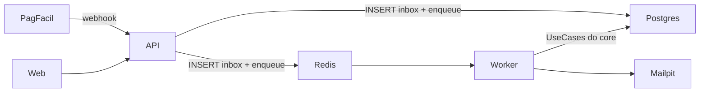

# Arquitetura

Regra de dependência: `apps/* -> packages/infra -> packages/core`. O core não importa ninguém.

```mermaid
flowchart LR
  PagFacil -->|webhook| API
  API -->|INSERT inbox + enqueue| Postgres & Redis
  Redis --> Worker
  Worker -->|UseCases do core| Postgres
  Worker --> Mailpit
  Web --> API
```
